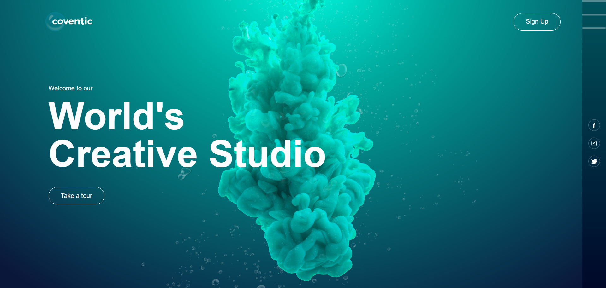

# bubbles-animation
This is a responsive animated website. I have developed it using HTML, CSS.

### Deployment
| Environment | Link |
|-------------|------|
| GitHub Pages | [GitHub Pages](https://rhythm1950.github.io/bubbles-animation/) |

### Technology Stack
#### Languages:
- 
- 

#### IDE Used:
- 

#### Version Control:
- 
- 

### Website Preview:

